# Steaming-07-trailer-tracking
- Purpose : Track the trailers based on the locations and generate alerts to the dispatchers 

# Name : Kamalini Pradhan
# Final project for Week 7 Data streaming course 
# This project is a initial version of the trailer tracking and notify user/dispatcher when and where the trailers are , Based on the status of the trailer disptcher can take necessary action if required .

## System Requirements

- Python 3.11 
- RabbitMQ server
- An email account for sending alerts (SMTP configuration)
- To send mails from Gmail account :
    1. Go to your Google Account.
    1. Click on "Security" in the left-hand navigation.
    1. Under "Signing in to Google," select "App passwords."
    1. You might need to sign in again.
    1. Under "Select app," choose "Mail."
    1. Under "Select device," choose the device you’re using (e.g., "Windows Computer").
    1. Click "Generate."
    1. A 16-character password will be displayed. This is your app password.

## Setup

1. **Install Required Packages**

    Create and activate a virtual environment (optional but recommended):

    ```bash
    python -m venv venv
    source venv/bin/activate  # On Windows use `venv\Scripts\activate`
    ```

    Install the required packages using pip:

    ```bash
    pip install -r requirements.txt
    ```

2. **Configure Email**

    Update the `send_email.py` file with your email credentials and SMTP server details.

3. **Start RabbitMQ Server**

    Ensure RabbitMQ server is installed and running. For installation and setup, refer to the [RabbitMQ website](https://www.rabbitmq.com/download.html).

## Running the System

1. **Generate and Send Data**

    Run the `generate_trailer_data.py` script to generate fake trailer data and send it to the appropriate RabbitMQ queues:
    Need to pass command line argument a numeric number to generate that many trailer data .

    ```bash
    python generate_data.py <number of trailers>
    ```

2. **Start Consumers**

    Run each consumer script in separate terminal windows to monitor the queues and send email alerts based on the conditions:

    ```bash
    python consumer_arriving.py
    python consumer_arrived.py
    python consumer_departed.py
    python consumer_idle.py
    python consumer_intransit.py
    ```

## Project Details

### `generate_trailer_data.py`

This script generates fake trailer data using the Faker library and sends it to different RabbitMQ queues based on the trailer status:

- `arriving_queue`: For trailers that are arriving
- `arrived_queue`: For trailers that have arrived
- `departed_queue`: For trailers that are departing
- `idle_queue`: For trailers that have been idle for more than 24 hours
- `in_transit_queue`: For trailers that are on road 

### `send_email.py`

This script contains the function `send_email` which is used by the consumers to send email alerts.

### Consumers

- `consumer_arriving.py`: Consumes data from `arriving_queue` and sends an alert when a trailer is arriving.
- `consumer_arrived.py`: Consumes data from `arrived_queue` and sends an alert when a trailer has arrived.
- `consumer_departed.py`: Consumes data from `departed_queue` and sends an alert when a trailer has departed.
- `consumer_idle.py`: Consumes data from `idle_queue` and sends an alert when a trailer has been idle for more than 24 hours.
- `consumer_intransit.py`: Consumes data from `in_transit_queue` and sends an report of all the trailers on road now when there are 5 trailers in deque.

## Example

Example output when running the consumers might look like:

In split window running the scripts
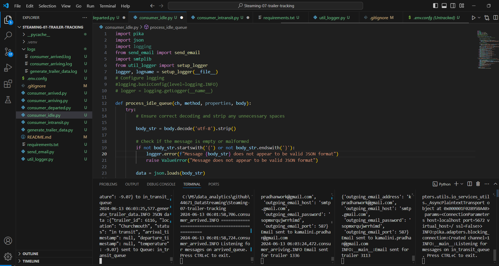

generate_trailer_data

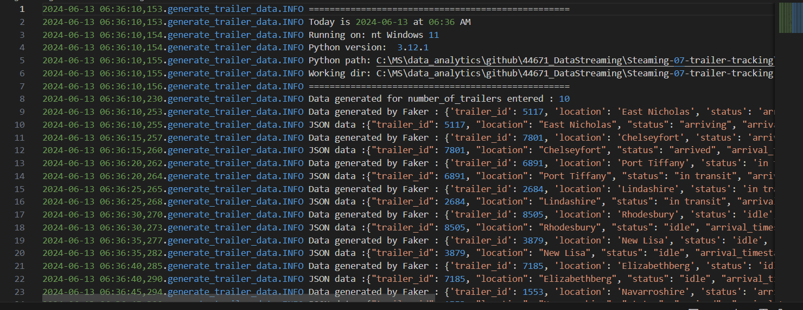

consumer_arriving.py

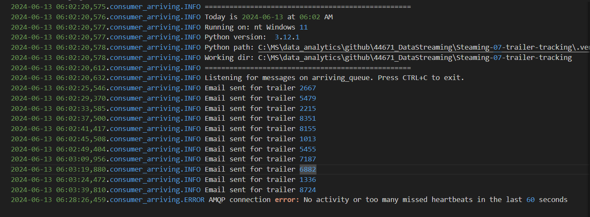

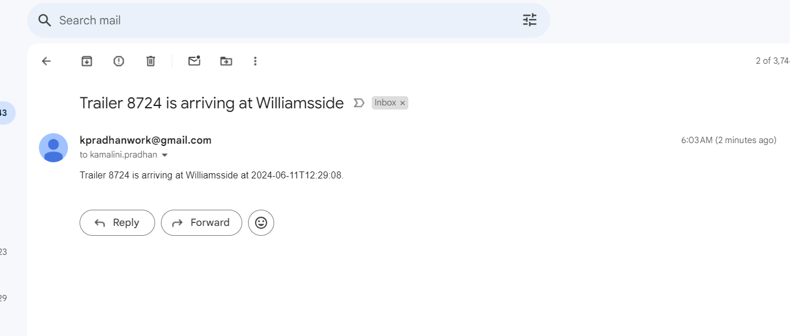

consumer_arrived.py

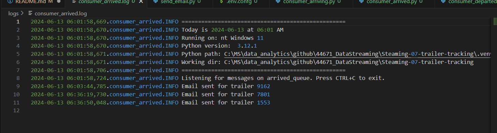
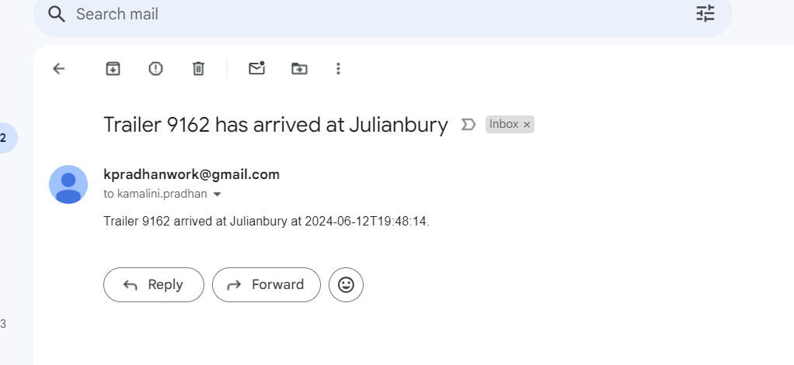

consumer_departed.py

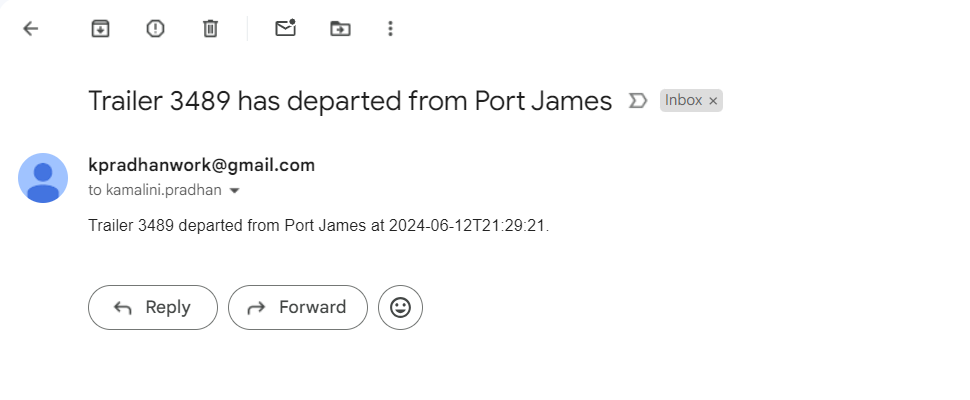

consumer_idle.py

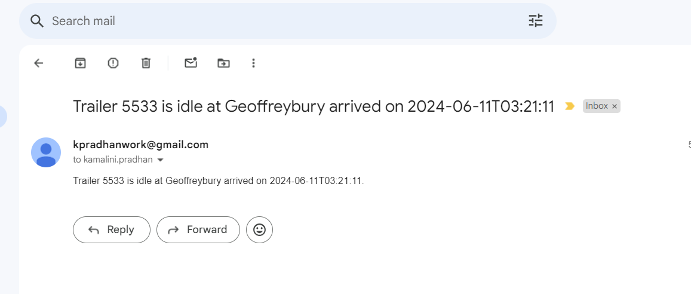

consumer_intransit.py
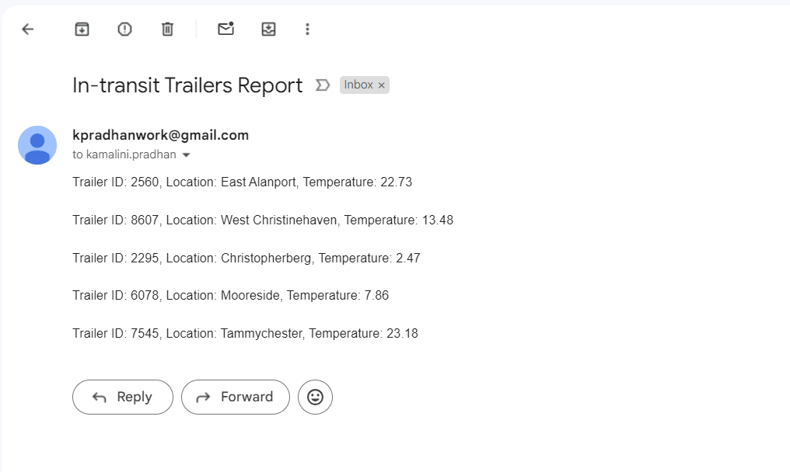
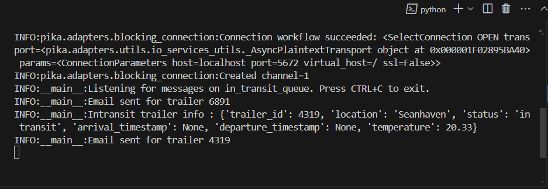

All email list
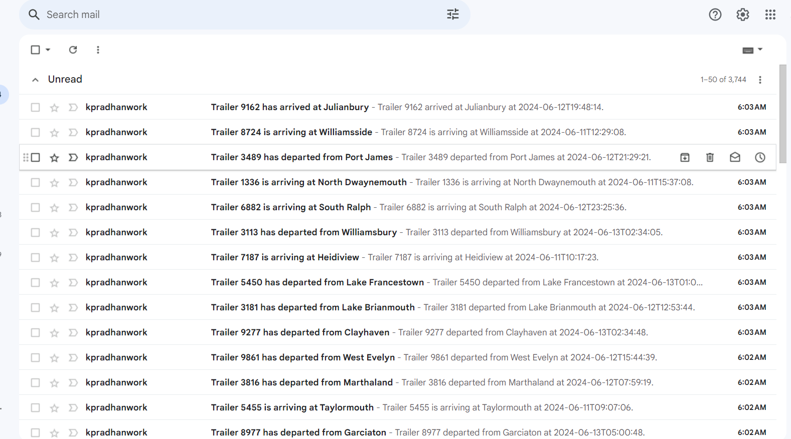